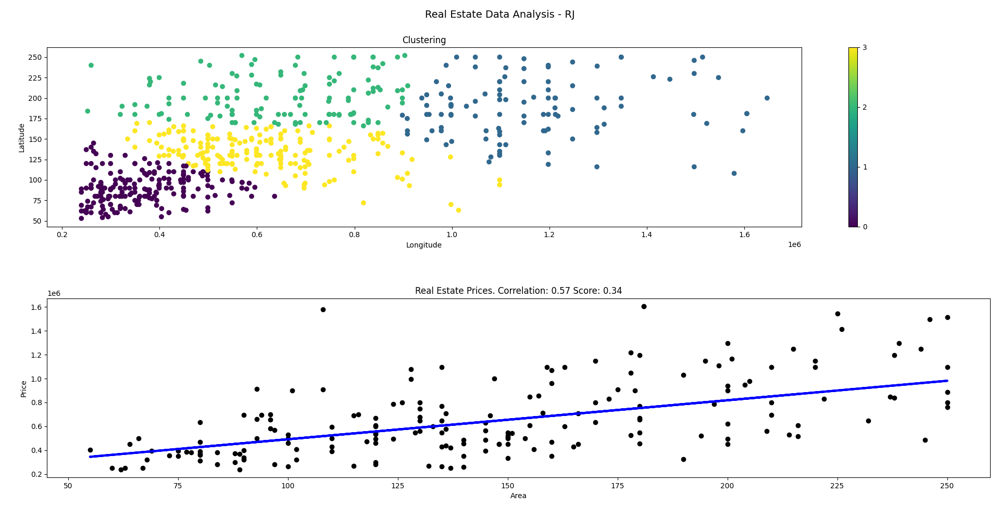

# Rio de Janeiro Real Estate Analysis: Clustering and Price Prediction

Data analysis and machine learning project to identify real estate price patterns and predict house prices in Rio de Janeiro using clustering and linear regression.

---

## Objective

This project addresses a challenge proposed by a large real estate company in Rio de Janeiro, Brazil, with two main goals:

1. Identify property profiles based on price and area (m²) of houses in Rio de Janeiro.
2. Evaluate the feasibility of building a predictive model for property prices based on area, and suggest improvements if necessary.

---

## Dataset

- File: `Brasile-real-estate-dataset.csv`
- Location: `/Dados` folder

The dataset includes real estate listings from across Brazil. For this project, only houses located in Rio de Janeiro were analyzed.

---

## Tools and Libraries

- Python 3
- pandas
- matplotlib
- scikit-learn

---

## Analysis Summary

### Clustering

- Filtered data for houses in Rio de Janeiro.
- Removed missing values.
- Selected features: `price_brl` and `area_m2`.
- Data normalization using `StandardScaler`.
- Used the Elbow Method (separately) to determine the optimal number of clusters.
- Applied KMeans clustering with 4 clusters.
- Identified distinct property profiles by price and size.

### Simple Linear Regression

- Built a model to predict house prices from area.
- Split data into training and testing sets.
- Evaluated model performance with correlation and R² score.
- Found that area alone provides limited predictive power.

---

## Results and Insights

- Clustering reveals clear groups of properties with different price and size characteristics.
- Simple linear regression shows moderate correlation but is insufficient for reliable price prediction.
- Suggest incorporating more variables such as location, number of rooms, and amenities.
- Recommend exploring multivariate models and potentially training models by region.

---

## Visualization

- Scatter plots of clusters.
- Regression line with actual vs predicted prices.
- Metrics displayed on graphs for better interpretation.

---

## Authors

- Maria Eduarda Ramos Ribeiro

---

## References

- Course materials Data Analysis - Big Data
- scikit-learn documentation
- Guidance from PaPy Bonel

---
